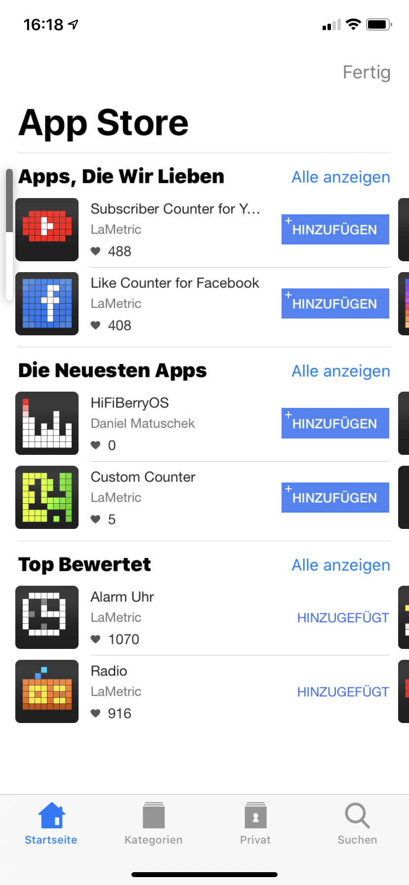
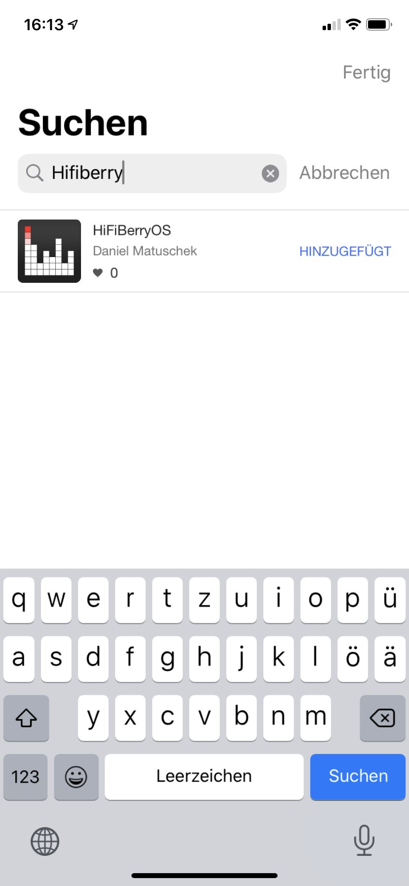
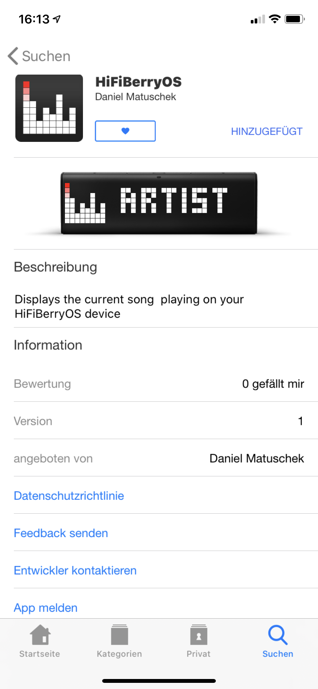

# LaMetric extension

[LaMetric Time](https://store.lametric.com/?rfsn=3238201.c5edf5) is a "connected clock".  We like the pixely look of it. 
While it's not the ideal device to display long text, it's still fun to use it with audiocontrol and 
[HiFiBerryOS](https://hifiberry.com/os).
We wouldn't recommend it as a music player (you have a HiFiBerry for this that will sound much better!), but as we like
it as a display.

The extension is quite simple (just have a look at the 
[source](https://github.com/hifiberry/audiocontrol2/blob/master/ac2/plugins/metadata/lametric.py)).

It will automatically detect LaMetric Time devices in your local network. No data will be send to LaMetric 
servers, everything is running locally.

To use the extension, you have to do 2 simple steps:

## Load the LaMetric module

Just add the line
```
[metadata:ac2.plugins.metadata.lametric.LaMetricPush]
```

to you /etc/audiocontrol2.conf file. If you're using HiFiBerryOS, this line should be there already.

## Install the LaMetric app

Open the LaMetric app on your smartphone, select your device and press the "+" button to add an app. 
This will open the LaMetric app store. Just search for "HiFiBerryOS" and install the app.






That's it. Audiocontrol will now send artist and song name of the song currently playing to your 
LaMetric devices in your local network.

## Advanced configuration

If you have multiple LaMetric devices in your network and you want them to show information from different
players, you can configure the IP address of the LaMetric device like this:
```
[metadata:ac2.plugins.metadata.lametric.LaMetricPush]
ip = 10.1.1.23
```
