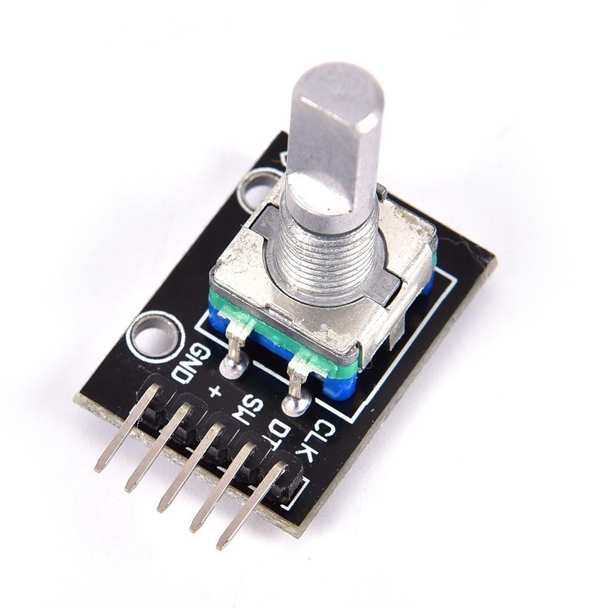

# Anatomy of a controller plugin

It's quite easy to extend audiocontrol with plugins that support addional methods to control players and/or volume.

A simple example is the "rotary controller" module that allows to use a rotary controller connected to some Raspberry Pi GPIOs. 
Rotation will be mapped to volume, while the button press will be mapped to play/pause command.

## Hardware

To understand the code a bit, let's first have a look at the hardware. We're using a standard rotary controller 
that is often called "KY040". The board is a standard rotary controller with a few external resistors. These are 
necessary! You can't connect a rotary controller to the Pi without these.



It will be connected to the Pi as follows:

| Encoder | GPIO Pin Pi | GPIO number |
|---|---|---|
|GND|9|GND|
|+|1|3.3V|
|CLK|7|4|
|DT|11|17|
|SW|13|27|

Make sure you understand the difference between Raspberry Pi GPIOs and Pin numbers! For the configuration, you need to use the GPIO number, not the physical pin numbers.

You can also use other unused GPIOs.We use these as they are close together. Cabled are directly soldered onto the Pins 
on a HiFiBerry MiniAmp like this:


While soldering onto the MiniAmp does void warranty, the MiniAmp is quite cheap and you might just risk t
his.
## Software

The module use for the control is [rotary.py](https://github.com/hifiberry/audiocontrol2/blob/master/ac2/plugins/control/rotary.py)

Let's have a look on some parts of it to understand what it does:

```
from ac2.plugins.control.controller import Controller
```

This imports the controller base object that will give access to both volume and player control

```
from pyky040 import pyky040
```

This imports a Python module that deals with the rotary control. In Python, you will often find existing modules that do what you 
need. Don't reinvent, just use what's already there!

```
class Rotary(Controller):

    def __init__(self, params: Dict[str, str]=None):
        super().__init__()
        
```

Our controller is inherited from the Controller class, we need to make sure to call its contructor

```
        self.clk = 4
        self.dt = 17
        self.sw = 27
        self.step = 5
```

Just some default settings

```
        if params is None:
            params={}
        
        if "clk" in params:
            try:
                self.clk = int(params["clk"])
            except:
                logging.error("can't parse %s",params["clk"])
            

        if "dt" in params:
            try:
                self.dt = int(params["dt"])
            except:
                logging.error("can't parse %s",params["dt"])

        if "sw" in params:
            try:
                self.sw = int(params["sw"])
            except:
                logging.error("can't parse %s",params["sw"])
                
        if "step" in params:
            try:
                self.step = int(params["step"])
            except:
                logging.error("can't parse %s",params["step"])
                
        logging.info("initializing rotary controller on GPIOs "
                     " clk=%s,dt=%s,sw=%s, step=%s%",
                     self.clk, self.dt, self.sw, self.step)
```

Parameters can be read from the audio control config file. If there are configuration in this file,
this code will just parse and use them.

```
        self.encoder = pyky040.Encoder(CLK=self.clk, DT=self.dt, SW=self.sw)
        self.encoder.setup(scale_min=0, 
                           scale_max=100, 
                           step=1, 
                           inc_callback=self.increase, 
                           dec_callback=self.decrease, 
                           sw_callback=self.button)
```

Initialize the pyky040 module with the setting. We don't use the "scale" attributes in our 
application, but they need to be defined.
The code maps three rotary control actions to methods. The will be called on "incease" (rotation 
to the left), "decrease" (rotation to the left) and "switch" (button pressed).

The methods are very simple:

```
    def increase(self,val):
        if self.volumecontrol is not None:
            self.volumecontrol.change_volume_percent(self.step)
        else:
            logging.info("no volume control, ignoring rotary control")

    def decrease(self,val):
        if self.volumecontrol is not None:
            self.volumecontrol.change_volume_percent(-self.step)
        else:
            logging.info("no volume control, ignoring rotary control")

    def button(self):
        if self.playercontrol is not None:
            self.playercontrol.playpause()
        else:
            logging.info("no player control, ignoring press")
```

We added some check if a player or volume control object is available. In some cases
(e.g. no alsa volume control configured, these object might be None and we don't want
the plugin to crash these cases.

Other then that the code is pretty straight-forward. The "increase" method just notifies 
the volume control to change the volume by the given step size (in %). The other method
are very similar.

We're almost done here, only one method is missing:

```
    def run(self):
        self.encoder.watch()
```

This makes sure, the plugin monitors the status of the GPIO pins the whole time and calls
the configured methods if there is some action.

## Configuration

Once you have configured the plugin, you need to put into one of the directories in audiocontrol's PYTHONPATH
If you're using HiFiBerryOS, we recommend to put it into /data/ac2plugins. Don't put it into /opt/... as these
files will be lost on the next update.

Now, you can configure it in /etc/audiocontrol2.conf:

```
[controller:ac2.plugins.control.rotary.Rotary]
clk = 4
dt = 17
sw = 27
step = 5
```

The "[controller:ac2.plugins.control.rotary.Rotary]" tells audiocontrol to load the controller class. 
The settings in the following lines will be send to the constructor as the "params" argument
